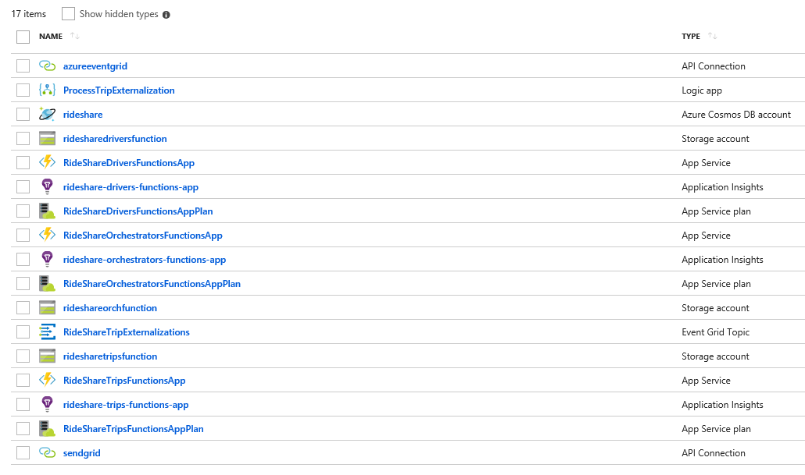

# RideShare .NET 

## Source Code

- Added VS-suitable `.gitignore` in the `donet` directory to prevent checking in `temp` and `obj` files
- Installed the `Micrsoft.Azure.WebJobs.Extension.DurableTask` Nuget package in the `ActiveDrivers` project to get it to compile
- Created a `Shared` project that contains services and common code
- Adjusted the `Models` project a bit by creating items and moved the existing entities to the `Entities` folder. The items will be used against the persistence layer. 
- Installed the `Microsoft.Azure.DocumnentDB.Core` in the `Shared` project. This is an anomaly....the standard libraries require `core` and they don't work with the existing non-core DocumentDB library
- The current `Microsoft.NET.Sdk.Functions` 1.0.14 comes bundled with `Newtonsoft.Json` version 11.0.2 while `Microsoft.NET.Sdk.Functions` 1.0.13 comes bundled with `Newtonsoft.Json` version 10.0.3. I will need to update all the other projects to 1.0.14 so we can match the version. 

## Coding Notes

- I feel there is no need to create multiple function apps for each Microservice. They can be functions within a big `RideShare` functions app.
- I created the `Shared` project that contains all the necessary elements which, I feel, makes it really easy to add new functionality 
- `IPersistenceService` has two implementations: `CosmosPersistenceService` and `SqlPersistenceService`. Only Cosmos is being used right now. 
- I assign Cosmos item ids manually which is a combination of the `collection type` and some identifier. Cosmos's `ReadDocumentAsync` retrieves really fast if an `id` is provided. 
- As best practice, the `Functions` implement a very thin layer of code and they rely on services to do the actual work.
- I created the following code services: `SettingService`and `PersistenceService` which implement `ISettingService` and `IPersistenceService` respectively
- I also created two additional auxiliary services: `ILoggerService` and `IAnalyticService`. I did not implement them yet. I feel they are important...we can discuss. 
- I used the concept if `ServiceFactory` to create instances. This is due to lack of `dependency injection` in `Functions`. At least I could not find a reasonable way to do it.
- For now, I embedded `Car` within `Driver`. It can be separated if need be.
- I used a naming convention in the function names i.e `G_Drivers`, `P_Drivers`, etc. This allows us to easily locate the function in the portal.

## Provisioning

I provisioned the following resources under a resource group called `RideShare` in `Solliance-DEV` subscription:



- For Cosmos, I initially attempted to auto-create the Cosmos Collection `Main` if it does not exist. But it failed because the partition key was not set. So I created it manually from the portal. 
- I hooked an `Application Insights` resource to the `Drivers Functions App` so it can be used to tracing. I also made it available in the `setting service` so it can be used by the `Analytic` service, for example, to send metrics and custom telemetry.

## Publishing

- I used `Visual Studio` to publish by right-clicking the functions app project and click publish. It worked the first time....they suggested that I allow `beta` in the app settings. They must have noticed the use of standard library.
- Subsequent publishes failed for no good reason. I had to use `Kudu` for the rescue. So I went in there, stopped the functions app, deleted its content, re-started the app and re-published. This worked. Unfortunately it is a lot of work!!
- I manually updated the functions app settings in the portal. I store in there the Cosmos settings, app insights and others.
- Later, perhaps we can use a more predictable method of publishing like `Cake` or something similar. 

## APIs

The following are currently finished and they seem to work:

### Get Drivers

`https://ridesharedriversfunctionsapp.azurewebsites.net/api/drivers?code=9FirhFik9qEqaARWcYJy6m/J0TSKf45TaFHoDEBB1bOblxWZ934Cfw==`

Sample return:

```
[
    {
        "code": "AA100",
        "firstName": "James",
        "lastName": "Beaky",
        "latitude": 31.3,
        "longitude": -118.5344,
        "car": {
            "driverCode": "AA100",
            "make": "BMW",
            "model": "735",
            "color": "Black",
            "licensePlate": "CA-8900",
            "id": "",
            "_self": "",
            "correlationId": "",
            "upsertDate": "2018-08-13T11:02:06.6702584+00:00",
            "collectionType": 0
        },
        "id": "AA100-Driver",
        "_self": "dbs/pGdxAA==/colls/pGdxAObIQoI=/docs/pGdxAObIQoIBAAAAAAAAAA==/",
        "correlationId": "",
        "upsertDate": "2018-08-13T11:06:38.4253139+00:00",
        "collectionType": 0
    }
]
```

### Get a Single Driver by code

`https://ridesharedriversfunctionsapp.azurewebsites.net/api/drivers/AA100?code=kRZyufB2P5Ep42drOhaKC8OaQCVOfk3v3Ry2LkMwPoWeF4xFh9eamw==`

Sample return:

```
{
    "code": "AA100",
    "firstName": "James",
    "lastName": "Beaky",
    "latitude": 31.3,
    "longitude": -118.5344,
    "car": {
        "driverCode": "AA100",
        "make": "BMW",
        "model": "735",
        "color": "Black",
        "licensePlate": "CA-8900",
        "id": "",
        "_self": "",
        "correlationId": "",
        "upsertDate": "2018-08-13T11:02:06.6702584+00:00",
        "collectionType": 0
    },
    "id": "AA100-Driver",
    "_self": "dbs/pGdxAA==/colls/pGdxAObIQoI=/docs/pGdxAObIQoIBAAAAAAAAAA==/",
    "correlationId": "",
    "upsertDate": "2018-08-13T11:06:38.4253139+00:00",
    "collectionType": 0
}
```

### Post Drivers (create a new driver)

`https://ridesharedriversfunctionsapp.azurewebsites.net/api/drivers?code=dFb4Ho6oMFajGUPL994a8sJyJ4d02j1K53qUGDGSjYsbEnJW6KvK1g==`

Sample payload:

```
{
	"code": "AA100",
	"firstName": "James",
	"lastName": "Beaky",
	"latitude": 32.7174,
	"longitude": -117.1628,
	"car": {
		"driverCode": "AA100",
		"make": "BMW",
		"model": "735",
		"color": "Black",
		"licensePlate": "CA-8900"
	}
}
```

### Update Driver Location by code

`https://ridesharedriversfunctionsapp.azurewebsites.net/api/drivers?code=6211jgIPccot4K344yAagDHBkf8ov0XH7Uu96KYinrIjbWY9w1ly7w==`

Sample payload:

```
{
	"driverCode": "AA100",
	"latitude": 31.3000,
	"longitude": -118.5344
}
```

### Get Driver Location Changes by code

`https://ridesharedriversfunctionsapp.azurewebsites.net/api/driverlocations/AA100?code=4dM0G1eaUMmM1NtaLfFneSUW92ITb9rFdPNGH3GEpnIQ9KZKTm2XKg==`

Sample return:

```
[
    {
        "driverCode": "AA100",
        "latitude": 31.3,
        "longitude": -118.5344,
        "id": "AA100-DriverLocation-9f05426b-e8e2-47e3-bd25-7f8221580625",
        "_self": "dbs/pGdxAA==/colls/pGdxAObIQoI=/docs/pGdxAObIQoICAAAAAAAAAA==/",
        "correlationId": "",
        "upsertDate": "2018-08-13T11:06:38.3807855+00:00",
        "collectionType": 1
    }
]
```

### Delete a Driver by code

`https://ridesharedriversfunctionsapp.azurewebsites.net/api/drivers/{code}?code=FyZWgqNAteL9ZzjjYsjRWppH674wspg1p0hWG8LNRHNG7A3KrCaYGw==`


